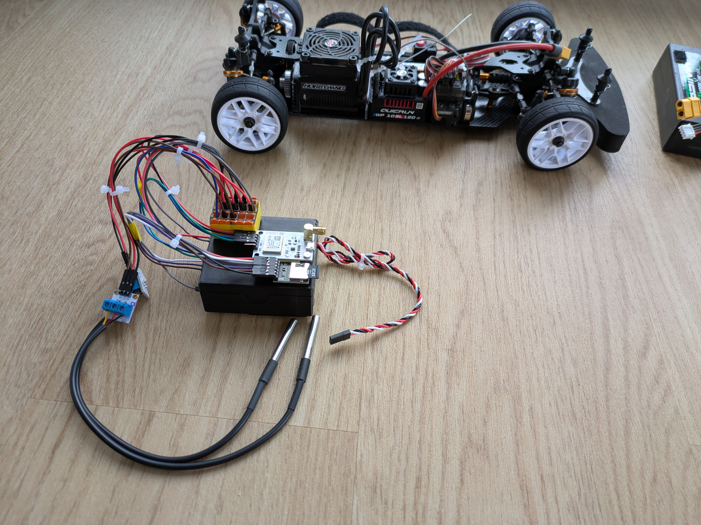

# Carten Telemetrie

## Inhaltsverzeichnis
* [1. Projektbeschreibung und Spezifikationen](#1-projektbeschreibung-und-spezifikationen)
* [2. Stückliste (Bill of Materials)](#2-stueckliste-bill-of-materials)
* [3. Schaltplan und Systemarchitektur](#3-schaltplan-und-systemarchitektur)
* [4. Implementierung und Aufbau](#4-implementierung-und-aufbau)
  * [4.1 Software und Firmware-Kompilierung](#41-software-und-firmware-kompilierung)
  * [4.2 Elektrische Verkabelung](#42-elektrische-verkabelung)
  * [4.3 Mechanische Integration](#43-mechanische-integration)
* [5. Betriebsmodus und Datenauswertung](#5-betriebsmodus-und-datenauswertung)
* [6. CI/CD: Reddit-Feedback-Synchronisation](#6-cicd-reddit-feedback-synchronisation)

## 1. Projektbeschreibung und Spezifikationen

 

Entwicklung eines lokalen Telemetriesystems für das ferngesteuerte Modellfahrzeug Carten T410R . Das System erfasst dynamische und thermische Parameter während des Fahrbetriebs.

**Erfasste Metriken und Spezifikationen:**
* **Temperatur:** Erfassung von Motor- und ESC-Temperaturen (Messbereich -55°C bis +125°C, Auflösung 12-Bit) über den 1-Wire-Bus.
* **Drehzahl:** RPM-Erfassung der Kardanwelle mittels Hall-Effekt-Sensor und Neodym-Magnet (Hardware-gestützter Pulse Counter).
* **Geodaten:** Aufzeichnung von Längen- und Breitengrad sowie der absoluten Geschwindigkeit (GNSS/GPS-Satellitendaten via NMEA 0183-Protokoll, Updaterate 1 Hz bis 10 Hz konfigurierbar).

**Architektur-Variante:**
* Ausschließliches Offline-Logging auf einer lokalen MicroSD-Karte. Zur Vermeidung von Latenzen und Verbindungsabbrüchen findet keine Datenübertragung über drahtlose Netzwerke statt.

## 2. Stückliste (Bill of Materials)
Für die Nachkonstruktion sind zwingend die folgenden Bauteile oder äquivalente Spezifikationen zu verwenden:

| Komponente | Spezifikation / Typ | Funktion im System |
| :--- | :--- | :--- |
| Microcontroller | ESP32 Dev Board (30-Pin Variante, z.B. NodeMCU) | Zentrale Ingestion und Verarbeitung der Sensorik |
| GPS-Modul | BN-220 (u-blox M8N) | Bereitstellung der Geodaten (Baudrate 9600) |
| Speichermodul | MicroSD-Karten-Modul (SPI) | Persistenter Datenspeicher (zwingend 3.3V Logik) |
| Temperatursensor | DS18B20 (TO-92 oder wasserdicht) | 2x Sensoren zur Temperaturüberwachung (Motor, ESC) |
| Drehzahlsensor | Hall-Sensor Modul (A3144) | Detektion von Magnetfeldänderungen |
| Magnet | Neodym-Magnet (3x2mm) | Rotierender Impulsgeber an der Kardanwelle |
| Stromversorgung | 3-Pin Servokabel (JR-Stecker) | 5V Spannungsabgriff über das BEC des RC-Empfängers |

## 3. Schaltplan und Systemarchitektur
Alle Hardwarekomponenten nutzen eine gemeinsame Masse (GND) zur Vermeidung von Floating-Potenzialen. Die serielle UART-Verbindung zwischen ESP32 und GPS-Modul erfordert eine physikalische Kreuzung der Leitungen (TX an RX, RX an TX). Der Spitzenstrombedarf des Gesamtsystems liegt bei etwa 200 mA bis 250 mA.

| Komponente | Interface | ESP32 Pin | Sensor Pin | Bemerkung |
| :--- | :--- | :--- | :--- | :--- |
| RC-Empfänger| Power | `VIN` | 5V (Rot) | Parasitäre Versorgung über ESC/Empfänger (BEC) |
| | | `GND` | GND (Schwarz)| Referenzpotenzial |
| GPS Modul| UART 2 | `GPIO 16` (RX2) | TX | VCC-Spannungsversorgung zwingend über 3.3V des ESP32 |
| | | `GPIO 17` (TX2) | RX | |
| MicroSD-Modul | SPI | `GPIO 23`, `19`, `18`, `5` | MOSI, MISO, SCK, CS | VCC-Spannungsversorgung zwingend über 3.3V des ESP32 |
| DS18B20 | 1-Wire | `GPIO 4` | DQ (Daten) | Parallelschaltung beider Sensoren |
| A3144 Hall-Sensor| Dig. Out | `GPIO 2` | DO (Signal) | Anbindung an ESP32 PCNT (Pulse Counter) |

*(Der detaillierte visuelle Schaltplan befindet sich im Verzeichnis `/schaltplan`.)*

## 4. Implementierung und Aufbau

### 4.1 Software und Firmware-Kompilierung
* **Umgebung:** Die Kompilierung erfordert PlatformIO oder die Arduino IDE.
* **Bibliotheken:** Zur Übersetzung des Quellcodes müssen `TinyGPSPlus`, `OneWire` und `DallasTemperature` im Library-Manager installiert sein.
* **Flash-Vorgang:** Die Firmware ist via USB-Schnittstelle auf den ESP32 zu überspielen. Bei Boot-Problemen ist der serielle Output (`115200` Baud) auf Initialisierungsfehler (z.B. SD-Karte nicht gefunden) zu prüfen.

### 4.2 Elektrische Verkabelung
* Das Servokabel ist polungsrichtig mit `VIN` (5V) und `GND` des ESP32 zu verlöten und an einen freien Port des RC-Empfängers anzuschließen.
* Die Verbindung von GPS, SD-Modul, Hall-Sensor und Temperatursensoren ist zwingend gemäß der dokumentierten Pin-Belegung vorzunehmen.
* Sämtliche Lötstellen sind durch Schrumpfschläuche zur Vermeidung von Kurzschlüssen bei Vibrationen zu isolieren.

### 4.3 Mechanische Integration
* **Zentraleinheit:** Die Befestigung des ESP32-Gehäuses im Chassis erfolgt über verschraubte Trägerplatten oder Klettband.
* **GPS:** Das GPS-Modul muss horizontal montiert werden. Die Keramik-Antenne muss ungehindert nach oben zeigen.
* **Drehzahlmessung:** Der Neodym-Magnet ist adhäsiv (z.B. Sekundenkleber oder Epoxidharz) auf der Kardanwelle zu fixieren. Ein entsprechendes Gegengewicht auf der gegenüberliegenden Seite der Welle verhindert Unwuchten bei hohen Rotationsgeschwindigkeiten. Der Hall-Sensor ist mit einem Spaltmaß von maximal 2 mm über dem Magneten starr zu positionieren.
* **Temperaturen:** Die DS18B20-Sensoren sind mit Wärmeleitkleber an ESC und Motorgehäuse anzubringen.

## 5. Betriebsmodus und Datenauswertung
* **Boot-Sequenz:** Das System startet autonom beim Einschalten des RC-Fahrzeugs. Nach erfolgreicher Initialisierung des SPI-Busses beginnt der Schreibvorgang.
* **Logging-Zyklus:** Die Sensordaten werden mit einer Frequenz von 2 Hz auf die MicroSD-Karte geschrieben. Die Limitierung auf 2 Hz verhindert Schreib-Puffer-Überläufe (Buffer Overruns) der SD-Karte.
* **Datenformat:** Die Ausgabe erfolgt als standardisierte CSV- oder JSON-Datei auf einer FAT32-formatierten Partition.
* **Post-Processing:** Nach Abschluss der Fahrt ist die MicroSD-Karte manuell zu entnehmen. Die Rohdaten können in Tabellenkalkulationsprogrammen oder Analyse-Skripten visualisiert und evaluiert werden.

## 6. CI/CD: Reddit-Feedback-Synchronisation
Eine konfigurierte GitHub Action dient der Extraktion von externem Projektfeedback aus dem verlinkten Reddit-Thread.

### Architektur
* **Python-Skript (`scripts/fetch_reddit.py`):** Verantwortlich für den Abruf des Reddit-RSS-Feeds und die HTML-Bereinigung der Kommentare.
* **Automatisierung (`.github/workflows/reddit-sync.yml`):** Der Cronjob triggert die Pipeline arbeitstäglich um 08:00 UTC.
* **Output-Handling:** Neu erfasste Kommentare werden in die Datei `reddit/reddit_feedback.md` geschrieben und durch die Action automatisch im `main`-Branch committet.

### Manueller Sync
Zur sofortigen Datensynchronisation:
* Im GitHub-Repository den Tab "Actions" öffnen.
* Den Workflow "Fetch Reddit Feedback" selektieren.
* "Run workflow" ausführen. Die Markdown-Datei wird daraufhin aktualisiert.
