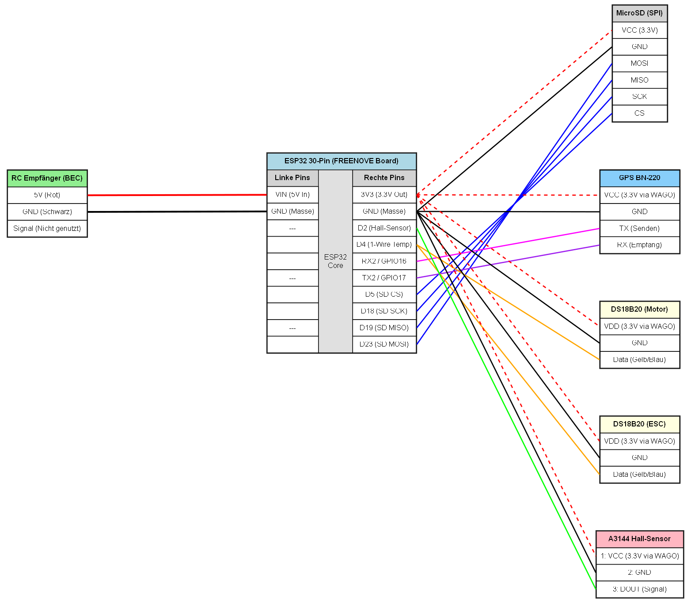

# RC-Telemetrie-System

## Inhaltsverzeichnis
* [1. System-Architektur](#1-system-architektur)
* [2. Schaltplan](#2-schaltplan)
* [3. Pin-Mapping](#3-pin-mapping)
* [4. Stromversorgung](#4-stromversorgung)
* [5. Schaltplan Generierung](#5-schaltplan-generierung)
* [6. Betrieb](#6-betrieb)

Dieses System erfasst Telemetriedaten (Geschwindigkeit, Drehzahl, Temperaturen) in einem RC-Fahrzeug als lokales Data-Logging.

## 1. System-Architektur
* Betriebsmodus: Batch-Logging auf MicroSD-Karte.
* GPS-Tracking: Ein GPS-Modul liefert Geodaten und Geschwindigkeitswerte via NMEA-Protokoll (Hardware-UART).
* Logging: Die MicroSD-Karte dient als primärer Speicher.
* Sensor-Auslesen: Die Erfassung erfolgt asynchron. Impulse des Hall-Sensors werden über einen Hardware-Zähler (PCNT) registriert.

## 2. Schaltplan



## 3. Pin-Mapping
Alle Komponenten benötigen eine gemeinsame Masse (GND). Serielle Verbindungen erfordern gekreuzte Leitungen (TX an RX, RX an TX).

| Komponente | Interface | ESP32 Pin | Sensor Pin | Bemerkung |
| :--- | :--- | :--- | :--- | :--- |
| RC-Empfänger | Power | `VIN` | 5V (Rot) | Versorgung über ESC/Empfänger |
| | | `GND` | GND (Schwarz)| Gemeinsame Masse |
| GPS Modul | UART 2 | `GPIO 16` (RX2) | TX | VCC an 3.3V ESP32 |
| | | `GPIO 17` (TX2) | RX | |
| MicroSD-Modul | SPI | `GPIO 23`, `19`, `18`, `5` | MOSI, MISO, SCK, CS | VCC an 3.3V ESP32 |
| DS18B20 (Motor)| 1-Wire | `GPIO 4` | DQ | |
| DS18B20 (ESC)| 1-Wire | `GPIO 4` | DQ | Parallelschaltung |
| A3144 Hall-Sensor| Digital Out | `GPIO 2` | DO | PCNT-Nutzung |

## 4. Stromversorgung
ESP32 und Sensorik benötigen 150-250 mA. Die Versorgung erfolgt über den Motorregler (ESC) und Empfänger.
1. Anschluss eines Servokabels an den RC-Empfänger.
2. Rotes Kabel (5V) an den VIN-Pin des ESP32.
3. Schwarzes Kabel (GND) an den GND-Pin des ESP32.

## 5. Schaltplan Generierung
Der Schaltplan wird mit Python und `uv` erstellt.

1. System-Abhängigkeit (Alpine Linux):
   ```bash
   sudo apk add graphviz
   ```
2. Tool `uv` herunterladen:
   ```bash
   curl -LsSf https://astral.sh/uv/install.sh | sh
   source $HOME/.local/bin/env
   ```
3. Skript ausführen:
   ```bash
   uv run --with graphviz schaltplan.py
   ```

## 6. Betrieb
1. Boot: Systemstart bei Einschalten des RC-Fahrzeugs.
2. Log: Speicherung der Sensordaten mit 2 Hz auf der MicroSD-Karte.
3. Analyse: Manuelles Einlesen der MicroSD-Karte.
